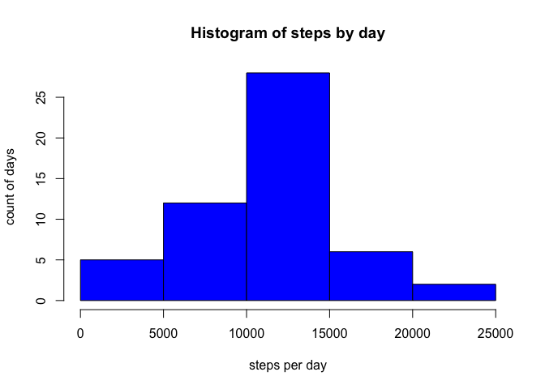
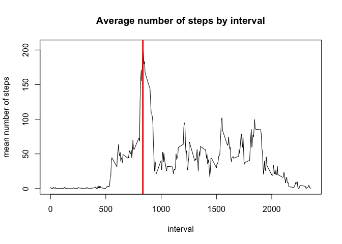
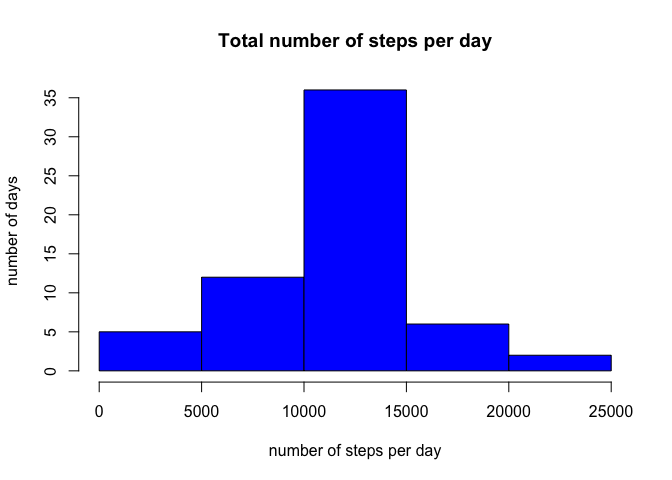
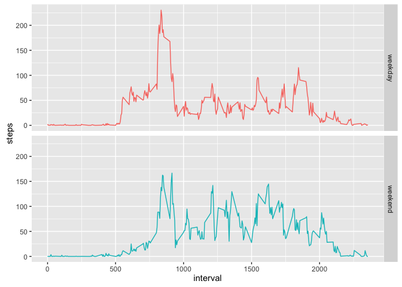

# Coursera- Reproducible Research: Project 1 - An analysis of activity data
JRB  
June 25, 2016  


  
##Loading and preprocessing the data 

```r
    #Downloading and unziping the file
    file.url = "https://d396qusza40orc.cloudfront.net/repdata%2Fdata%2Factivity.zip"
    download.file("https://d396qusza40orc.cloudfront.net/repdata%2Fdata%2Factivity.zip","./data/repdataactivity.zip",method="curl")
    unzip("./data/repdataactivity.zip",exdir="./data")
    #load the unzipped file into R
    activity <- read.csv("./data/activity.csv")
```
Data downloaded from ``https://d396qusza40orc.cloudfront.net/repdata%2Fdata%2Factivity.zip`` on ``Fri 01 Jul 2016``, 
total loaded observations ``17568``   

## What is the mean total number of steps taken per day ?  

```r
    steps.by.day <- aggregate(data=activity,steps ~ date,sum) # sum steps by date
    hist(steps.by.day$steps,
         breaks=4,
         xlab="steps per day",
         ylab="count of days",
         main="Histogram of steps by day",
         col="blue")
```

<!-- -->

The mean (ignoring missing values) number of steps taken each days is
``10766.19`` and the median is ``10765``. 
  
***
  
##What is the average daily activity pattern? 
Let's look at a quick graph first: **Time series of the average number of steps by 5 minutes interval
across all days** ...  

```r
steps.by.interval <- aggregate(data=activity,steps~interval,mean)
plot(steps.by.interval,
     type="l",
     main="Average number of steps by interval",
     ylab="mean number of steps")
# draw a line to indicate the interval with the greatest number of steps
abline(v=steps.by.interval[which.max(steps.by.interval$steps),]$interval,col="red",lwd=3)
```

<!-- -->
  
The interval ``835`` (red line in graph) is,on average, the interval with the most steps across all days.
  
***
  
##Imputing missing data  
1. There are ``2304`` missing value in the activity dataset.   
2. We will replace missing data (NA) by the mean of steps for that specific interval.  

```r
    ## Imputing missing data using the mean of the interval as imputed data
    ## 
    ## first, get all rows having a missing value
    missing.index <- activity[is.na(activity$steps),]
    ## replace NA value by corresponding interval mean, interval mean is the steps value in steps.by.interval derived earlier
    missing.index$steps <-steps.by.interval[steps.by.interval==missing.index$interval,]$steps
    ## now merge this in orginal activity data set
    activity.imp.mean <- activity 
    activity.imp.mean[is.na(activity$steps),]$steps <- missing.index$steps
```
 
3. aggregate the data (mean steps per day) to build the histogram.   


```r
    imp.steps.per.day <- aggregate(data=activity.imp.mean, steps ~ date,sum)
    hist(imp.steps.per.day$steps, 
         main="Total number of steps per day",
         xlab="number of steps per day",
         ylab="number of days", 
         col="blue")
```

<!-- -->
  
The mean is ``10766.19`` and the median is ``10766.19``   

The mean of steps  of the original data set is
``10766.19`` ,
the mean of the imputed data set is
``10766.19``,
which is the same...  
  
***
  
##Are there differences in activity patterns between weekdays and weekends ?

```r
    activity.imp.mean$daytype <- weekdays(as.Date.factor(activity.imp.mean$date),TRUE) #add the new variable daytype
    activity.imp.mean[activity.imp.mean$daytype %in% c("Sat","Sun"),]$daytype <- "weekend" 
    activity.imp.mean[activity.imp.mean$daytype != "weekend",]$daytype <- "weekday"
    activity.imp.mean$daytype <- as.factor(activity.imp.mean$daytype) #transform daytype to factor
    steps.by.interval.daytype <- aggregate(data=activity.imp.mean,
                                           steps ~ daytype+interval,mean) #calculate the mean across intervals and daytype
    myplot <- ggplot(data=steps.by.interval.daytype,
                     aes(x=interval,
                         y=steps,
                         color=daytype)) #setup the plot data and aesthetic
    myplot <- myplot + geom_line() + facet_grid(daytype~.) + guides(color=FALSE) #adds the geometry, create the panels and adjust the legend
    print(myplot) # Render the plot
```

<!-- -->


